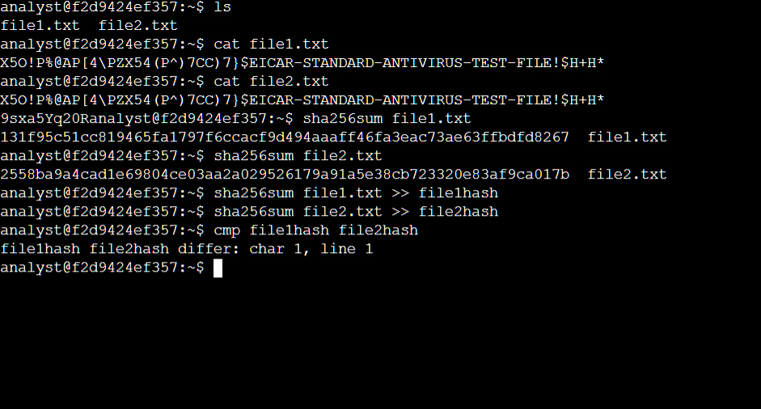

# LABORATORIO: Create hash values
## Lugar de realización y enlace de la actividad
**[Qwiklabs](https://www.qwiklabs.com/)**

**[Enlace a la actividad](https://www.cloudskillsboost.google/focuses/42747959)** 

## Certificado y curso
**[Google Cybersecurity Certificate](https://www.coursera.org/professional-certificates/google-cybersecurity)**

**Enlace al curso:**  
[Assets, Threats, and Vulnerabilities](https://www.coursera.org/learn/assets-threats-and-vulnerabilities)

## Descripción de la Actividad
En este laboratorio, se implementaron controles de seguridad mediante la generación y comparación de valores hash para identificar posibles alteraciones en archivos. Se utilizaron comandos de Linux para crear y comparar hashes de dos archivos, con el objetivo de determinar si sus contenidos eran realmente idénticos o diferentes, a pesar de que visualmente parecían iguales.

## Pasos Realizados

1. **Listar archivos en el directorio:**  
    Se utilizó el comando `ls` para verificar la existencia de los archivos `file1.txt` y `file2.txt` en el directorio de trabajo.

2. **Visualizar el contenido de los archivos:**  
    Se empleó el comando `cat file1.txt` y `cat file2.txt` para mostrar el contenido de ambos archivos y confirmar que, a simple vista, eran iguales.

3. **Generar valores hash SHA-256:**  
    Se generaron los valores hash de ambos archivos usando `sha256sum file1.txt` y `sha256sum file2.txt`. Se observó que los hashes resultantes eran diferentes, lo que indica que los archivos no son idénticos.

4. **Guardar los hashes en archivos separados:**  
    Se redirigieron los resultados de los hashes a archivos nuevos usando `sha256sum file1.txt >> file1hash` y `sha256sum file2.txt >> file2hash`.

5. **Comparar los archivos hash:**  
    Se utilizó el comando `cmp file1hash file2hash` para comparar los archivos de hash byte por byte, confirmando que existían diferencias desde el primer carácter.

## Comandos Usados y Explicación

| Comando                | Descripción                                                      | Ejemplo de uso                  |
|------------------------|------------------------------------------------------------------|---------------------------------|
| `ls`                   | Lista los archivos y carpetas en el directorio actual.           | `ls`                            |
| `cat`                  | Muestra el contenido de un archivo en la terminal.               | `cat file1.txt`                 |
| `sha256sum`            | Genera el valor hash SHA-256 de un archivo.                      | `sha256sum file1.txt`           |
| `cmp`                  | Compara dos archivos byte por byte e indica la primera diferencia.| `cmp file1hash file2hash`       |

## Resultados Obtenidos
Tras realizar la actividad, se comprobó que aunque los archivos `file1.txt` y `file2.txt` parecían idénticos al visualizar su contenido, los valores hash generados fueron diferentes. Esto permitió identificar que existían diferencias no visibles a simple vista. Los archivos de hash (`file1hash` y `file2hash`) también resultaron distintos, y la comparación con `cmp` confirmó la discrepancia desde el primer carácter.

## Conclusiones
Este laboratorio permitió comprender la importancia de los valores hash como herramienta para verificar la integridad de archivos. A través de comandos básicos de Linux, se demostró que dos archivos pueden parecer iguales pero ser diferentes a nivel de datos, lo que resalta la utilidad de los hashes en la ciberseguridad. Como mejora, se podría automatizar la comparación de múltiples archivos o explorar otros algoritmos de hash para fortalecer los controles de integridad.
